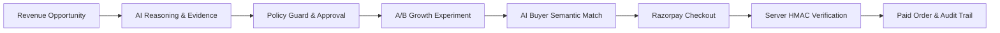

# RAYGO — Autonomous Revenue Intelligence & Agentic Commerce

> **Empowering modern merchants to discover hidden revenue opportunities, safely test growth actions, and transact autonomously with AI buyers via verified Razorpay checkout.**

[-10B981?style=flat-square)](https://github.com/)
[](https://github.com/)
[](https://github.com/)
[-000000?style=flat-square)](https://github.com/)
[](LICENSE)

---

## 1. Executive Overview & Value Proposition

RAYGO transforms static e-commerce stores into dynamic, autonomous revenue engines. By continuously analyzing catalog synergy graphs and conversion telemetry, RAYGO surfaces high-impact revenue opportunities, formulates controlled A/B experiments, exposes the catalog to autonomous AI Buyer agents, and closes the loop through cryptographically verified Razorpay transactions with strict safety firewalls.



---

## 2. The Problem & The RAYGO Solution

| The Merchant Problem | The RAYGO Solution |
|---|---|
| **Fragmented Opportunities**: Merchants lack real-time visibility into high-synergy product pairs and revenue leaks. | **Revenue Intelligence Engine**: Graph synergy scanner surfaces cross-sells, dynamic bundles, and pricing opportunities. |
| **Uncontrolled AI Actions**: Businesses fear autonomous agents making unauthorized discounts or financial commitments. | **Policy Guard & Approval Gateway**: Mathematical margin floors (>=25%), discount caps (<=20%), and human authorization. |
| **AI Buyer Disconnect**: Emerging AI buyer agents cannot discover, negotiate, or purchase products programmatically. | **Agentic Commerce Readiness**: Natural language intent parsing, compatibility checks, and dynamic basket construction. |
| **Payment Drop-Offs & Duplicate Retries**: Failed payments cause churn; naive automated retries cause duplicate charges. | **Payment Resilience & Recovery**: Deterministic failure classification, blocked automatic retries, and guided manual recovery. |
| **Opaque AI Decisions**: Merchants cannot audit why an agent recommended or executed an action. | **Forensic Audit Trail & Control Plane**: Live agent run traces with latencies, tool arguments, and correlation IDs. |

---

## 3. Razorpay Buildathon Alignment: Track 01

| Buildathon Track 01 Goal | Implemented RAYGO Capability | Implementation Reference |
|---|---|---|
| **Grow Merchant Revenue** | Ranked revenue opportunities with impact projections | [`app/services/revenue_intelligence.py`](docs/ARCHITECTURE.md#3-multi-agent-orchestration--ai-architecture) |
| **AI-Driven Commerce** | Autonomous AI Buyer agent for natural language procurement | [`app/services/ai_buyer_agent.py`](docs/ARCHITECTURE.md#3-multi-agent-orchestration--ai-architecture) |
| **Product Discovery & Bundling** | Semantic catalog search & dynamic bundle builder | [`app/services/catalog_synergy_service.py`](docs/ARCHITECTURE.md) |
| **Autonomous AI Transacting** | AI Buyer Intent → Basket → Order Intent → Checkout | [`app/api/v1/ai_buyer.py`](docs/API_OVERVIEW.md) |
| **Controlled Money Actions** | Policy Guard hard mathematical boundaries & Approval Gateway | [`app/services/policy_guard.py`](docs/SECURITY_AND_SAFETY.md) |
| **Conversational Operations** | Merchant Copilot answering real grounded business questions | [`app/services/copilot_service.py`](docs/ARCHITECTURE.md) |
| **Payment Integrity & Recovery** | Razorpay Test Mode checkout, server verification, retry prevention | [`app/services/payment_agent.py`](docs/ARCHITECTURE.md#5-razorpay-payment-architecture--resilience) |
| **Auditability & Explainability** | Immutable cryptographic audit ledger with correlation IDs | [`app/services/audit_service.py`](docs/SECURITY_AND_SAFETY.md) |

---

## 4. System Architecture

```mermaid
flowchart TD
    subgraph UI ["Client Presentation Layer (Next.js 14 / Tailwind / 120Hz)"]
        A[Overview Dashboard]
        B[Opportunity Center]
        C[Experiment Tracker]
        D[AI Commerce & Buyer]
        E[Checkout & Recovery]
        F[Merchant Copilot]
        G[Agent Control Plane & Audit]
    end

    subgraph API ["Gateway & Services (FastAPI Python 3.11+)"]
        H[API Routers /api/v1]
        I[Raygo Coordinator & Specialist Mesh]
        J[Policy Guard & Approval Gateway]
        K[Payment & Recovery Engine]
    end

    subgraph Authorities ["State, Payment & Reasoning Authorities"]
        L[(MongoDB / mongomock Runtime DB)]
        M[Razorpay Test Gateway (HMAC Verification)]
        N[Gemini LLM / Fast-Path Fallback]
        O[Cryptographic Audit Ledger]
    end

    UI -->|REST / JSON| API
    API --> Authorities
```

*For complete architectural specifications, see [docs/ARCHITECTURE.md](docs/ARCHITECTURE.md).*

---

## 5. Multi-Agent Mesh & Safety Firewall

RAYGO coordinates 7 specialized agents operating under a strict **Zero Direct AI Execution** rule:

1. **Raygo Coordinator**: Natural language intent routing across agents.
2. **Revenue Intelligence Agent**: Discovers catalog synergies and calculates revenue lift.
3. **Growth Strategist Agent**: Structures A/B test hypotheses within pricing policies.
4. **Experiment Intelligence Agent**: Tracks variant performance with Bayesian lift modeling.
5. **AI Commerce Agent**: Semantic product compatibility and dynamic basket synthesis.
6. **Payment Agent**: Razorpay order lifecycle, failure classification, and recovery.
7. **Policy Guard**: Deterministic mathematical firewall enforcing hard constraints.

### Safety Model & Hard Boundaries
- **Discount Ceiling**: Discounts exceeding **20%** are permanently rejected.
- **Margin Floor**: Bundles resulting in net margin below **25%** are permanently rejected.
- **Permanent Payment Retry Lock**: Automatic background retries after payment failure are **hard-blocked** to eliminate duplicate billing risks. Policy unlocking returns HTTP 403 `POLICY_BLOCKED`.
- **Human-in-the-Loop Gateway**: Consequential and financial tools require explicit merchant human authorization.

*For complete security details, see [docs/SECURITY_AND_SAFETY.md](docs/SECURITY_AND_SAFETY.md).*

---

## 6. Demonstrated User Journeys

### 6.1 The Golden Path (Primary 5-Minute Tour)
1. **Overview Dashboard (`/overview`)**: Total Revenue `₹2,84,620`, Lift `+14.2%`, AI Readiness `82/100`.
2. **Opportunity Center (`/opportunities`)**: Review ProBook + Keyboard Stand duo (+₹142,500/mo impact).
3. **Approval Gateway (`/experiments`)**: Policy Guard validates 15% discount; merchant approves live experiment.
4. **AI Buyer Procurement (`/ai-commerce`)**: Natural language query (`"laptop setup for AI dev under 70000"`) builds optimized basket (`₹68,499`).
5. **Razorpay Checkout (`/checkout`)**: Test payment completes; backend validates HMAC-SHA256 signature and fulfills order.
6. **Agent Control Plane (`/agents`, `/audit`)**: Live trace drawer details latency, tool arguments, and cryptographic audit log.

### 6.2 The Payment Resilience & Recovery Path
1. **Payment Failure (`/payment/failure`)**: Simulated decline is deterministically classified as `card_declined`.
2. **Hard Policy Boundary**: Policy Guard blocks automated retries to prevent duplicate card charges.
3. **Actionable Remediation**: User receives clear advice ("Try UPI or a different card") with single-click manual retry.

*For step-by-step judge demonstration instructions, see [docs/GOLDEN_DEMO.md](docs/GOLDEN_DEMO.md).*

---

## 7. Technology Stack & Verification

### Tech Stack
- **Frontend**: Next.js 14.2.35, React 18, TypeScript 5, Tailwind CSS 3.4, Framer Motion, Lucide Icons.
- **Backend**: FastAPI 0.115, Python 3.11+, Pydantic v2, Uvicorn, Motor (Async MongoDB).
- **Payment Gateway**: Razorpay Test Mode with server-side HMAC-SHA256 signature verification.
- **AI Engine**: Google Gemini (via `google-genai`) with zero-latency deterministic fast-path fallback.
- **Testing**: Pytest 8.3, Pytest-Asyncio, Httpx, Mongomock-Motor.

### Automated Test Suite: **108 / 108 Tests Passing (100%)**
```bash
# Run the complete test suite (unit, integration, security, 11-case benchmark eval):
cd apps/api
.venv/Scripts/python.exe -m pytest apps/api/app/tests -v -W ignore
```
- **108 passed in 16.21s** across 14 test modules.
- **TypeScript & Linting**: `tsc --noEmit` and `next lint` pass with **0 errors**.

---

## 8. Local Setup & Quick Start

### Prerequisites
- Node.js 18+ & npm
- Python 3.11+

### 1. Backend Setup
```bash
cd apps/api
python -m venv .venv
# On Windows:
.venv\Scripts\activate
# On Unix:
# source .venv/bin/activate
pip install -r requirements.txt
python -m uvicorn app.main:app --port 8000 --reload
```
API server will run at `http://localhost:8000` (Swagger docs at `http://localhost:8000/docs`).

### 2. Frontend Setup
```bash
cd apps/web
npm install
npm run dev
```
Web app will run at `http://localhost:3000`.

---

## 9. Key Documentation Links

- [Detailed System Architecture (`docs/ARCHITECTURE.md`)](docs/ARCHITECTURE.md)
- [System Architecture Diagram (`docs/architecture.mmd`)](docs/architecture.mmd)
- [Multi-Agent Architecture Diagram (`docs/agent-architecture.mmd`)](docs/agent-architecture.mmd)
- [Golden Demo & Failure Walkthrough (`docs/GOLDEN_DEMO.md`)](docs/GOLDEN_DEMO.md)
- [Security & Safety Governance (`docs/SECURITY_AND_SAFETY.md`)](docs/SECURITY_AND_SAFETY.md)
- [API Overview Reference (`docs/API_OVERVIEW.md`)](docs/API_OVERVIEW.md)

---
*RAYGO — Built for Autonomous Commerce with Deterministic Safety.*
