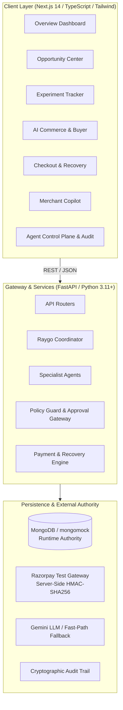
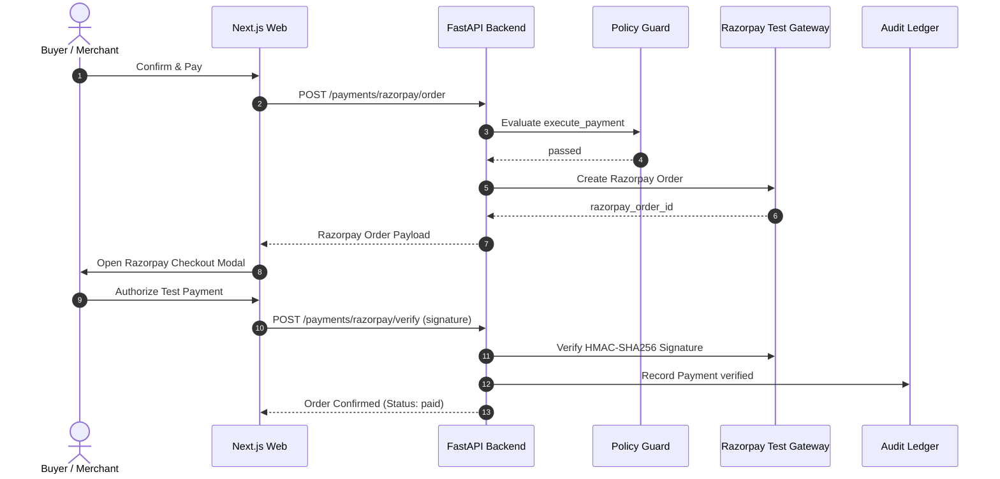

# RAYGO: Comprehensive System & Technical Architecture

## 1. System Overview

RAYGO is an autonomous revenue intelligence and agentic commerce platform built for the **Razorpay AI Builder Buildathon 2026 (Track 01: AI Growth & Agentic Commerce)**.

The system addresses three critical pain points in modern digital commerce:
1. **Latent Revenue Discovery**: Merchants fail to capture catalog synergies due to static bundling and unmonitored drop-offs.
2. **AI Buyer Readiness**: Autonomous AI buyer agents require structured semantic discovery, dynamic bundle construction, and policy-compliant purchasing without human intervention.
3. **Payment Integrity & Recovery**: Payment failures kill conversion, while unguided retries risk catastrophic duplicate charges.



---

## 2. Layer-by-Layer Architecture

### 2.1 Presentation Layer (`apps/web`)
- **Framework**: Next.js 14.2 (App Router) with React 18 and TypeScript.
- **Design Tokens & Styling**: Preserved from Google Stitch design export. Custom Tailwind CSS tokens, zero Tailwind runtime dependencies beyond build, and custom glassmorphic layering (`glass-surface`, `glass-surface-strong`).
- **120Hz Fluid Rendering**: GPU-accelerated compositing layers (`translate3d`, `backdrop-filter`, `will-change`) optimized for high-refresh ProMotion displays.
- **API Client**: Strongly typed `api-client.ts` with transparent fallback to demo fixtures if the API backend is unreachable.

### 2.2 Backend & Gateway Layer (`apps/api`)
- **Framework**: FastAPI (Python 3.11+) running on Uvicorn with standard asynchronous I/O.
- **Routers**: 12 modular `/api/v1` routes:
  - `/onboarding`: Store connection & initialization.
  - `/dashboard/overview`: Revenue KPI aggregation, lift metrics, and active opportunity cards.
  - `/products`: Catalog search, filtering, activation/deactivation, and stock adjustments.
  - `/opportunities`: Opportunity discovery, ranked catalog synergies, and approval triggers.
  - `/experiments`: A/B experiment lifecycles, Bayesian lift calculations, and catalog scaling.
  - `/ai-commerce`: AI catalog readiness index and semantic compatibility profiles.
  - `/ai-buyer`: Autonomous buyer intent parsing, semantic search, and basket generation.
  - `/order-intents`: Checkout intent state machine.
  - `/orders`: Confirmed paid orders ledger.
  - `/payments`: Razorpay test order creation, HMAC signature verification, failure classification, dismissal tracking, and reconciliation.
  - `/policies`: Policy guard evaluations and rule limits.
  - `/agents`: Agent health, tool registries, run traces, and Merchant Copilot conversational Q&A.
  - `/audit`: Forensic immutable audit trail queryable by correlation ID.

---

## 3. Multi-Agent Orchestration & AI Architecture

```mermaid
flowchart LR
    A[Inbound Query / Event] --> B[Raygo Coordinator]
    B -->|Intent Routing| C[Specialist Agent Layer]
    subgraph Specialists ["Specialist Agents"]
        D[Revenue Intelligence]
        E[Growth Strategist]
        F[Experiment Intelligence]
        G[AI Commerce]
        H[Payment Agent]
        I[Merchant Copilot]
    end
    C --> Specialists
    Specialists --> J[Domain Tool Allow-List]
    J --> K[Policy Guard]
    K -->|Financial Action| L[Approval Gateway]
    L -->|Authorized| M[State Mutation / Razorpay]
```



### 3.1 The 7 Agent Roles

| Agent | Responsibility | Inbound Input | Outbound Artifact | Execution Mode |
|---|---|---|---|---|
| **Raygo Coordinator** | Semantic intent classification and request routing | User query / buyer request | Routed action & agent name | Deterministic Fast Path + Gemini Fallback |
| **Revenue Intelligence** | Synergy graph analysis and opportunity detection | Catalog sales and checkout drops | Ranked Opportunity | Grounded DB calculation |
| **Growth Strategist** | Pricing strategies and discount proposition | Opportunity metadata | Experiment Hypothesis | Grounded DB + Policy Check |
| **Experiment Intelligence** | Live A/B test variant tracking & Bayesian lift | Experiment ID and traffic telemetry | Scale / Terminate Decision | Mathematical Lift Engine |
| **AI Commerce / Buyer** | Natural language discovery & dynamic basket construction | Buyer request string & budget | Validated Product Basket | Semantic Matcher |
| **Payment Agent** | Razorpay lifecycle, failure diagnosis, and resilience | Order intent & payment callback | Payment Attempt & Diagnosis | Razorpay Test Gateway |
| **Policy Guard** | Mathematical boundary enforcement & duplicate protection | Proposed action dictionary | `passed` \| `requires_approval` \| `blocked` | Pure Deterministic Rule Engine |

### 3.2 Tool Registry & Side-Effect Classification

Every tool exposed to agents is registered in `app/domain/tool_registry.py` with strict side-effect classification:
- **`READ_ONLY`**: `get_product`, `list_opportunities`, `get_revenue_summary` (no state change, un-gated).
- **`CONSEQUENTIAL`**: `create_experiment`, `scale_experiment`, `adjust_stock` (creates business objects, gated by Policy Guard).
- **`FINANCIAL`**: `create_order`, `verify_payment` (impacts funds, requires explicit human authorization).
- **Disallowed Tools**: `delete_merchant_account`, `drop_database`, `direct_refund` are strictly excluded from the tool registry.

---

## 4. Policy Guard & Approval Gateway (Zero Direct AI Execution)

```text
[ AI Proposal / Buyer Request ]
               │
               ▼
   [ Policy Guard Validation ]
   • Discount <= 20% limit?
   • Margin >= 25% floor?
   • Automatic retry attempted? -> PERMANENTLY BLOCKED
               │
      ┌────────┴────────┐
   PASSED            BLOCKED ──► [ Audit Event: Violation Logged ]
      │
      ▼
   [ Approval Gateway ]
   • Is action FINANCIAL or CONSEQUENTIAL?
      ├── YES ──► [ Requires Merchant Human Confirmation ]
      └── NO  ──► [ Execute Safe Action ]
```

### 4.1 Enforced Mathematical Hard Rules
1. **Max Discount Cap**: Proposed discounts exceeding 20% (`DISCOUNT_MAX_PCT`) are hard-blocked with outcome `blocked`.
2. **Min Margin Floor**: Proposed net margins below 25% (`MARGIN_MIN_PCT`) are hard-blocked.
3. **Permanent Retry Lock**: Automatic payment retries after a failure are permanently blocked (`action_type == "retry_payment"` returns `outcome: "blocked"`). Unlocking `policy_payment_retry` returns HTTP 403 `POLICY_BLOCKED`.
4. **Zero Model Invention**: AI models are never the source of truth for prices, totals, or stock levels. All financial calculations originate in deterministic backend code.

---

## 5. Razorpay Payment Architecture & Resilience



### 5.1 Failure Recovery & Resilience Architecture
- **Checkout Dismissal (`POST /payments/razorpay/dismiss`)**: Closing the modal records `buyer_cancelled`, preserving the checkout intent without marking it failed.
- **Deterministic Diagnostic Engine (`RevenueRecoveryService`)**: Classifies gateway errors into:
  - `card_declined` (e.g. `BAD_REQUEST_ERROR`, expired card).
  - `gateway_issue` (e.g. `GATEWAY_ERROR`, `SERVER_ERROR`).
  - `buyer_cancelled` (user dismissed).
  - `insufficient_funds`.
  - `network_timeout`.
- **Safe Recovery UX**: Displays actionable remediation ("Try UPI or a different card") with single-click manual retry while Policy Guard blocks background automated retries.

---

## 6. Persistence & Data Architecture

### 6.1 Runtime Source of Truth: MongoDB
The authoritative runtime database is **MongoDB / mongomock-motor** across 19 collections:
1. `merchants`
2. `categories`
3. `products`
4. `dashboard_snapshots`
5. `opportunities`
6. `experiments`
7. `policies`
8. `policy_evaluations`
9. `approvals`
10. `agent_runs`
11. `agent_activity`
12. `buyer_intents`
13. `baskets`
14. `order_intents`
15. `orders`
16. `razorpay_orders`
17. `payment_attempts`
18. `webhook_events`
19. `audit_events`

### 6.2 Supabase / Postgres Reference Schema
A comprehensive 19-table PostgreSQL migration schema (`apps/api/app/db/supabase_migrations/001_initial_schema.sql`) and repository scaffold (`supabase_repositories.py`) is maintained in the codebase as the reference architecture for future relational migrations.

---

## 7. Security & Observability Architecture

### 7.1 Security & Secret Protection
- **Zero Secrets in Frontend**: Strict build-time assertions ensure no API keys or database connection strings exist in client bundles.
- **Server-Side Signature Verification**: Razorpay payment signatures are validated on the backend using secret HMAC keys.
- **Idempotency Service**: Consequential and financial mutations require `Idempotency-Key` headers to prevent double-execution.

### 7.2 Correlation & Auditability
Every consequential request generates a `correlation_id` propagated across:
- `buyer_session` → `basket` → `order_intent` → `razorpay_order` → `agent_run` → `policy_evaluation` → `audit_event`.

---

## 8. Known Technical Limitations (Disclosed for Judges)

1. **Authentication**: Uses demo-friendly header resolution (`X-Merchant-Id: merchant_novatech`) rather than a full OAuth2/JWT identity provider.
2. **Razorpay Environment**: Configured for Razorpay Test Mode with HMAC stub signing support for deterministic automated test suites.
3. **Database Dual Architecture**: MongoDB serves as the live runtime authority; Supabase tables are maintained as migration blueprints.
